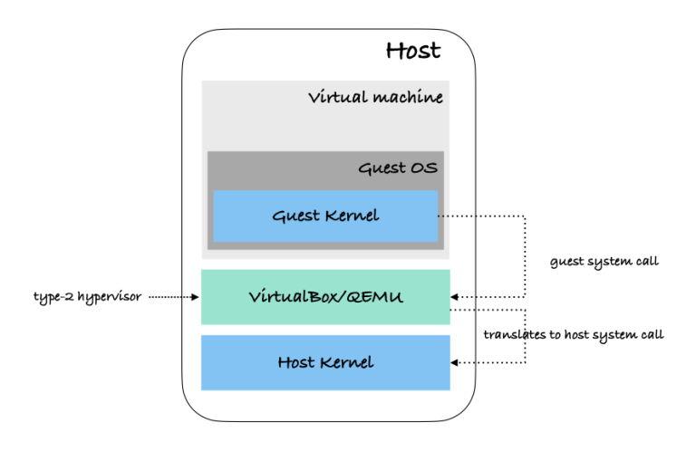
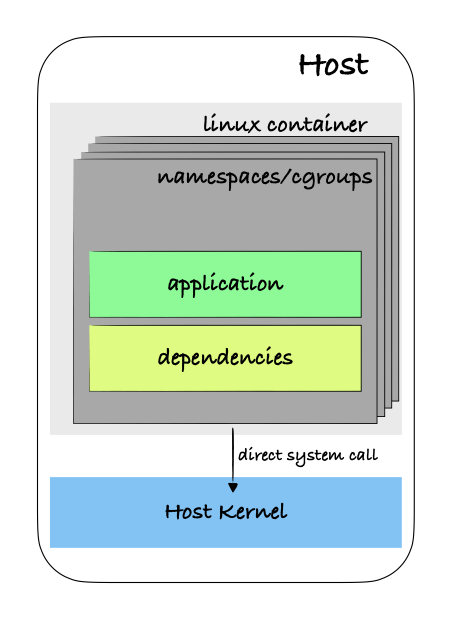

# namespace

## 命令行

```
unshare --help

用法：
 unshare [选项] [<程序> [<参数>...]]

以某些未与父(进程)共享的名字空间运行某个程序。

选项：
 -m, --mount[=<文件>]      取消共享 mounts 名字空间
 -u, --uts[=<文件>]        取消共享 UTS 名字空间(主机名等)
 -i, --ipc[=<文件>]        取消共享 System V IPC 名字空间
 -n, --net[=<file>]        取消共享网络名字空间
 -p, --pid[=<文件>]        取消共享 pid 名字空间
 -U, --user[=<文件>]       取消共享用户名字空间
 -C, --cgroup[=<文件>]     取消共享 cgroup 名字空间
 -T, --time[=<文件>]       取消共享时间名字空间

 -f, --fork                在启动<程序>前 fork
 --map-user=<uid>|<name>   map current user to uid (implies --user)
 --map-group=<gid>|<name>  map current group to gid (implies --user)
 -r, --map-root-user       将当前用户映射为 root (连带打开 --user)
 -c, --map-current-user    map current user to itself (implies --user)
 --map-auto                map users and groups automatically (implies --user)
 --map-users=<inneruid>:<outeruid>:<count>
                           map count users from outeruid to inneruid (implies --user)
 --map-groups=<innergid>:<outergid>:<count>
                           map count groups from outergid to innergid (implies --user)

 --kill-child[=<signame>]  when dying, kill the forked child (implies --fork)
                             defaults to SIGKILL
 --mount-proc[=<dir>]      mount proc filesystem first (implies --mount)
 --propagation slave|shared|private|unchanged
                           modify mount propagation in mount namespace
 --setgroups allow|deny    control the setgroups syscall in user namespaces
 --keep-caps               retain capabilities granted in user namespaces

 -R, --root=<dir>          run the command with root directory set to <dir>
 -w, --wd=<dir>            change working directory to <dir>
 -S, --setuid <uid>        set uid in entered namespace
 -G, --setgid <gid>        set gid in entered namespace
 --monotonic <offset>      set clock monotonic offset (seconds) in time namespaces
 --boottime <offset>       set clock boottime offset (seconds) in time namespaces

 -h, --help                显示此帮助
 -V, --version             显示版本

更多信息请参阅 unshare(1)。
```

你可以看到，前几个选项中的大多数都允许我们指定不同类型的命名空间，下面是我们在Linux系统中所拥有的不同类型的命名空间。
我们将在未来的一篇文章中更详细地讨论cgroups，因为它在容器世界中扮演着非常重要的角色。

| Namespace | Flag            | Page                  | Isolates                             | 说明                                                                                                                   |
|-----------|-----------------|-----------------------|--------------------------------------|----------------------------------------------------------------------------------------------------------------------|
| Cgroup    | CLONE_NEWCGROUP | cgroup_namespaces(7)  | Cgroup root directory                | 2016年作为Linux 4.6版本的一部分引入，限制了系统中特定进程组(在此命名空间下)的资源使用(cpu，内存，磁盘等)。正如我们将在以后的文章中看到的那样，在我们现在生活的容器化世界中，这是Linux内核的一个非常重要的特性! |
| IPC       | CLONE_NEWIPC    | ipc_namespaces(7)     | System V IPC, POSIX message queues   | 允许在命名空间内的进程之间定义共享内存段，用于进程间通信，而不会干扰其他命名空间。                                                                            |
| Network   | CLONE_NEWNET    | network_namespaces(7) | Network devices, stacks, ports, etc. | 为新命名空间虚拟化网络堆栈。这意味着新的命名空间将拥有自己的虚拟接口、私有IP、IP路由表、套接字等。                                                                  |
| Mount     | CLONE_NEWNS     | mount_namespaces(7)   | Mount points                         | 允许管理系统中的挂载点。在新的名称空间中卸载不会对主主机产生任何影响，因为每个新的挂载都是当前名称空间私有的。                                                              |
| PID       | CLONE_NEWPID    | pid_namespaces(7)     | Process IDs                          | 包含自己的一组进程id (pid)。每次我们创建一个新的名称空间时，进程都会被分配PID 1。在新命名空间中创建的每个子进程都将被分配后续id。                                             |
| Time      | CLONE_NEWTIME   | time_namespaces(7)    | Boot and monotonic clocks            | 这个命名空间最近在Linux(2020)中发布，它允许通过指定不同的时间命名空间在我们的系统中拥有不同的系统时间。                                                            |
| User      | CLONE_NEWUSER   | user_namespaces(7)    | User and group IDs                   | 包含一组独立的用户id和组id，可以分配给进程。                                                                                             |
| UTS       | CLONE_NEWUTS    | uts_namespaces(7)     | Hostname and NIS domain name         | 允许系统为每个命名空间拥有不同的主机名和域名。                                                                                              |

现在我们已经了解了Linux中所有现有的名称空间类型，我们将通过一个简单的示例来理解名称空间给我们带来的强大功能。

```shell
unshare --user --pid --map-root-user --mount-proc --fork bash 
```

- `–user`: Create a new user namespace.
- `–pid`: Create a new pid namespace. (Will fail if –fork is not specified)
- `–map-root-user`: Wait to start the process until the current user (running unshare command) gets mapped to the superuser in the new namespace. This allows having root privileges within the namespace, but not outside of that scope.
- `–mount-proc`: Mount /proc filesystem in the new namespace and create a new mount, this is to be able to have different processes with same process IDs in both namespaces.
- `–fork`: Run command as a child process of the unshare command, instead of running it directly. It’s required when creating a new PID namespace.

让我们看看这意味着什么。首先，如果我们列出新命名空间中的进程，我们只会看到在新命名空间中运行的新进程，而不会看到在主机默认命名空间中运行的进程

```
$ ps -ef
PID   USER     TIME  COMMAND
    1 root      0:00 /bin/bash
    2 root      0:00 ps -ef
```

## namespace在容器中的作用

自2002年以来，Linux内核中已经提供了名称空间，但是，它们的使用仅限于具有非常高级的Linux系统知识的人员。
Linux namespace和容器是由Docker“流行”起来的，当它使容器在整个领域的广泛采用成为可能时，任何对Linux内核内部的了解都是最少的(或零)。
namespace 的使用对用户来说是不透明的，这可能就是为什么大多数用户不能真正理解容器的原因。
在这个领域中，有相当多的人将容器视为某种虚拟机，它不包含内核，而是与主机共享内核。
这是对容器的错误理解，我们很快就会看到原因。
容器会产生一种错觉，使您认为实际上正在主机上运行虚拟机，但事实远非如此。
当你在你的主机上运行一个虚拟机时，你实际上是在你的机器上启动一个新的操作系统发行版，不同之处在于这个操作系统将调用你使用的虚拟化引擎(virtual Box, QEMU等)提供的中间件。

这个中间件将虚拟机中的每个内核调用转换为主机可以理解的系统调用。这使得在unix系统上运行不同的操作系统(如Windows)成为可能!



另一方面，Linux容器利用Linux namespace来提供运行不同操作系统的假象。
当我们基于任何Linux发行版创建映像时，我们实际上是在安装它的文件系统，这给我们的印象是在一个新的操作系统上。但实际上我们只是在一个新的命名空间中!


